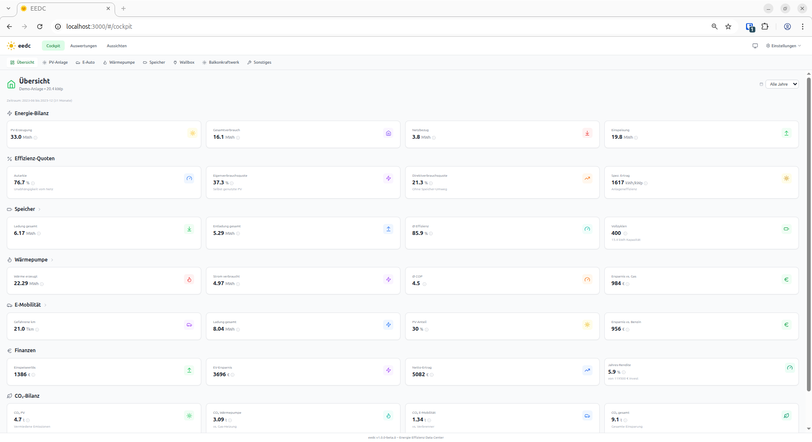
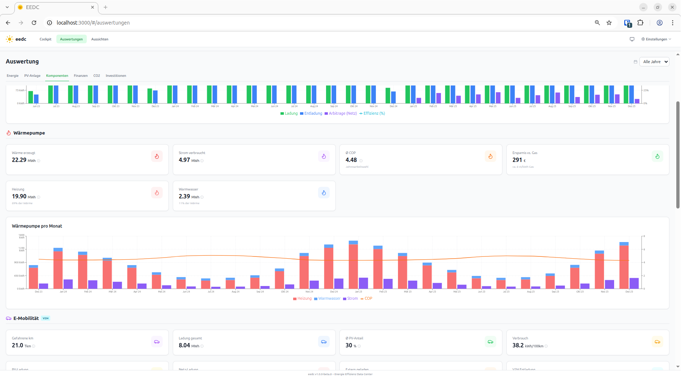

<p align="center">
  
</p>

<p align="center">
  <strong>Version 3.16.1</strong> | Standalone PV-Analyse mit optionaler Home Assistant Integration
</p>

<p align="center">
  <a href="https://supernova1963.github.io/eedc-homeassistant/"></a>
  <a href="https://opensource.org/licenses/MIT"></a>
</p>

---

## Was ist eedc?

**eedc** (Energie Effizienz Data Center) ist eine lokale Anwendung zur umfassenden Auswertung und Wirtschaftlichkeitsanalyse von Photovoltaik-Anlagen. Die Software läuft standalone oder als Home Assistant Add-on und speichert alle Daten lokal.

### Warum eedc?

- **Keine Cloud-Abhängigkeit** – Alle Daten bleiben auf deinem Server
- **Standalone-fähig** – Funktioniert ohne Home Assistant
- **Echtzeit-Monitoring** – Live Dashboard mit animiertem Energiefluss
- **Universelle Anbindung** – MQTT-Inbound für jedes Smarthome-System
- **Umfassende Analyse** – Von Energiebilanz bis ROI-Berechnung
- **Multi-Komponenten** – PV-Anlage, Speicher, E-Auto, Wärmepumpe, Wallbox, Balkonkraftwerk

---

## Empfohlene Nutzung

eedc ist eine **datendichte Analyse-App** — viele KPIs nebeneinander, feinachsige Charts, Tabellen mit vielen Spalten. Optimal nutzbar auf **Desktop**. Smartphone in Standard-Anzeigegröße funktioniert für Live-Dashboard und einfache Sichten; für die datendichten Auswertungs-Bereiche ist ein größerer Bildschirm sinnvoll. Bei stark erhöhtem Anzeigezoom (iOS „Größerer Text", HA-Companion-Seitenzoom über Standard) können einzelne Layouts eng werden.

---

## Features

### Live Dashboard

- **Animiertes Energiefluss-Diagramm** – SVG mit Flusslinien, SoC-Pegelanzeige, Tooltips mit Tages-kWh
- **Tagesverlauf** – 24h-Chart mit PV, Verbrauch, Netz, Speicher (auch historisch abrufbar)
- **Wetter-Widget** – Stunden-Prognose mit IST/Prognose-Overlay und Solar Forecast ML (SFML) Vergleich
- **Heute/Gestern kWh** – Tagessummen pro Komponente
- **Demo-Modus** für Erstnutzer ohne konfigurierte Sensoren

### MQTT-Inbound – Universelle Datenbrücke

- **Jedes Smarthome-System** – HA, Node-RED, ioBroker, FHEM, openHAB
- **HA Automation Generator** – Wizard erstellt fertige YAML-Automationen
- **Energy → Monatsabschluss** – MQTT-Energiedaten als Vorschläge (Konfidenz 91%)

### MQTT-Gateway – Geräte direkt anbinden

- **Topic-Translator** – Eigene MQTT-Topics von Shelly, OpenDTU, Tasmota und Co. auf EEDC-Felder mappen
- **Geräte-Presets** – Vordefinierte Mappings für gängige Geräte (Shelly, OpenDTU, Tasmota, ...)
- **9 Geräte-Connectors** – SMA, Fronius, go-eCharger, Shelly, OpenDTU, Kostal, sonnenBatterie, Tasmota, EcoFlow

### Aktueller Monat

- **Energie-Bilanz** mit Datenquellen-Indikatoren pro Feld
- **Vorjahresvergleich** und SOLL/IST-Vergleich
- **Komponenten-Karten** und Finanz-Übersicht

### Cockpit & Dashboards

- **Modernisiertes Cockpit** mit Hero-Leiste (Top-KPIs + Jahres-Trend), Energie-Fluss-Diagramm, Ring-Gauges und Sparkline
- **8 spezialisierte Dashboards** für jede Komponente
- **Amortisations-Fortschrittsbalken** – Investitionsrückfluss auf einen Blick
- **Formel-Tooltips** zeigen Berechnungsgrundlagen per Hover
- **Mobile-optimiert** – Responsive Cockpit-Tabs, angepasste KPI-Darstellung auf Smartphones

### Auswertungen & Reporting

- **7 Analyse-Tabs**: Energie, PV-Anlage, Komponenten, Finanzen, CO2, Investitionen, **Tabelle (Energie-Explorer)**
- **Interaktiver Energie-Explorer** – Alle 22 Monatsspalten in sortierbarer Tabelle, Spaltenauswahl per localStorage, Vorjahresvergleich mit Δ-Farbkodierung
- **ROI-Dashboard** mit Amortisationskurve und Parent-Child Aggregation
- **SOLL-IST Vergleich** gegen PVGIS-Prognosen
- **CSV/JSON Export** für externe Weiterverarbeitung

### Aussichten (Prognosen)

- **4 Prognose-Tabs**: Kurzfristig (7 Tage), Langfristig (12 Monate), Trend-Analyse, Finanzen
- **Kurzfrist-Prognose** mit Wetter-Daten (Open-Meteo) und mehreren Wettermodellen (MeteoSwiss ICON-CH2, ICON-D2, ICON-EU, ECMWF IFS, auto)
- **Solar Forecast ML (SFML)** – KI-basierter Ertragsprognose-Vergleich: EEDC vs. SFML vs. IST
- **Langfrist-Prognose** mit PVGIS-Daten und Performance-Ratio
- **Trend-Analyse** mit Degradationsberechnung und saisonalen Mustern

### Datenerfassung – Viele Wege führen nach EEDC

- **HA-Statistik** – Direkt aus der HA Recorder-Langzeitstatistik (SQLite **und MariaDB/MySQL**)
- **Cloud-Import** – SolarEdge, Fronius, Huawei, Growatt, Deye/Solarman, EcoFlow PowerOcean
- **Custom-Import** – Beliebige CSV/JSON-Dateien mit flexiblem Feld-Mapping
- **MQTT Energy** – Monatswerte aus MQTT-Topics (91% Konfidenz)
- **Portal-Import** – CSV-Upload von Herstellerportalen (SMA Sunny Portal, Fronius Solarweb, evcc)
- **Monatsabschluss-Wizard** – Geführte monatliche Datenerfassung mit Datenquellen-Status
- **Demo-Daten** zum Ausprobieren

### Infothek – Verträge & Dokumente

- **14 Kategorien** mit Vorlagen: Strom-, Gas-, Wasser-, Einspeisevertrag, Versicherung, Wartung, MaStR, ...
- **Datei-Upload** – Fotos (JPEG, PNG, HEIC) und PDFs pro Eintrag, direkt in der Datenbank gespeichert
- **Investitions-Verknüpfung** – Wartungsvertrag → Wechselrichter, Garantie → Speicher, ...
- **PDF-Export** aller Infothek-Einträge für den klassischen Hefter

### Steuerliche Features

- **Kleinunternehmerregelung** – USt auf Eigenverbrauch bei Regelbesteuerung
- **Spezialtarife** – Separate Strompreise für Wärmepumpe und Wallbox
- **Firmenwagen** – Dienstliches Laden mit AG-Erstattung in der ROI-Berechnung
- **Sonstige Positionen** – Flexible Erträge und Ausgaben pro Monat

### Investitions-Management

- **Parent-Child Beziehungen**: PV-Module → Wechselrichter, DC-Speicher → Hybrid-WR
- **Typ-spezifische Parameter**: V2H, Arbitrage, kWp, Ausrichtung, Neigung
- **ROI-Berechnung** pro Komponente und aggregiert

### Community-Vergleich (optional)

- **Anonymer Benchmark** mit anderen PV-Anlagen auf [energy.raunet.eu](https://energy.raunet.eu)
- **6 Analyse-Tabs**: Übersicht, PV-Ertrag, Komponenten, Regional, Trends, Statistiken
- **Achievements** und Rang-Badges
- Jederzeit löschbar – ein Klick entfernt alle geteilten Daten

---

## Schnellstart

### Option 1: Home Assistant Add-on

1. Repository zu HA Add-ons hinzufügen:
   ```
   https://github.com/supernova1963/eedc-homeassistant
   ```
2. Add-on "EEDC" installieren und starten
3. Über die Sidebar öffnen

### Option 2: Standalone mit Docker

```bash
# Standalone-Repository klonen
git clone https://github.com/supernova1963/eedc.git
cd eedc

# Mit Docker Compose starten
docker compose up -d

# Browser öffnen
open http://localhost:8099
```

> **Multi-Arch:** Das Docker-Image steht für `amd64` und `arm64` (Raspberry Pi 4/5, Apple Silicon) bereit.

> **Hinweis:** Das Standalone-Deployment nutzt das eigenständige [eedc Repository](https://github.com/supernova1963/eedc).

### Option 3: Lokale Entwicklung

```bash
# Backend starten
cd eedc && source backend/venv/bin/activate
uvicorn backend.main:app --reload --port 8099

# Frontend starten (neues Terminal)
cd eedc/frontend && npm run dev

# Browser öffnen
open http://localhost:3000
```

---

## Dokumentation

> **Tipp:** Die Dokumentation ist auch als Website verfügbar: **[supernova1963.github.io/eedc-homeassistant](https://supernova1963.github.io/eedc-homeassistant/)**

| Dokument | Beschreibung |
|----------|--------------|
| [Benutzerhandbuch](docs/BENUTZERHANDBUCH.md) | Vollständige Anleitung für Endbenutzer |
| [Infothek-Handbuch](docs/HANDBUCH_INFOTHEK.md) | Verträge, Zähler & Dokumente verwalten |
| [Architektur](docs/ARCHITEKTUR.md) | Technische Dokumentation für Entwickler |
| [Changelog](CHANGELOG.md) | Versionshistorie und Änderungen |
| [Entwicklung](docs/DEVELOPMENT.md) | Setup für lokale Entwicklung |

---

## Screenshots

### Cockpit Übersicht
Die Hauptansicht zeigt alle wichtigen KPIs auf einen Blick:
- Energiebilanz (Erzeugung, Verbrauch, Einspeisung)
- Effizienz-Kennzahlen (Autarkie, Eigenverbrauchsquote)
- Komponenten-Status (Speicher, E-Auto, Wärmepumpe)
- Finanzielle Auswertung (Einsparungen, ROI)


### Auswertungen
Detaillierte Analysen in 7 Kategorien:
- Jahresvergleich mit Delta-Indikatoren
- PV-String-Performance nach Ausrichtung
- Interaktiver Energie-Explorer (Tabellen-Tab)
- Amortisationskurven für alle Investitionen


---

## Architektur-Überblick

```
┌─────────────────────────────────────────────────────────┐
│                    Frontend (React)                     │
│  Vite + TypeScript + Tailwind CSS + Recharts            │
├─────────────────────────────────────────────────────────┤
│                    Backend (Python)                     │
│  FastAPI + SQLAlchemy 2.0 + SQLite                      │
├─────────────────────────────────────────────────────────┤
│              Externe APIs / Datenquellen                │
│  Open-Meteo │ PVGIS │ MQTT │ HA │ Cloud-APIs │ Connectors│
└─────────────────────────────────────────────────────────┘
```

---

## Repositories

| Repository | Zweck |
|---|---|
| **[eedc-homeassistant](https://github.com/supernova1963/eedc-homeassistant)** (dieses) | Source of Truth: HA-Add-on + Website + Dokumentation |
| **[eedc](https://github.com/supernova1963/eedc)** | Standalone-Distribution (wird per Release-Script synchronisiert) |
| **[eedc-community](https://github.com/supernova1963/eedc-community)** | Anonymer Community-Benchmark-Server |

---

## Home Assistant Integration

EEDC bietet flexible Home Assistant Integration mit mehreren Ansätzen:

### Sensor-Mapping (Empfohlen)

Mit dem **Sensor-Mapping-Wizard** ordnest du deine bestehenden HA-Sensoren den EEDC-Feldern zu:
- Basis-Sensoren: PV-Erzeugung, Einspeisung, Netzbezug, Außentemperatur
- PV-Module: Pro String oder kWp-Verteilung
- Speicher: Ladung, Entladung, Netz-Ladung
- E-Auto: km, Ladung (PV/Netz/Extern), V2H
- Wärmepumpe: Strom, Heizung (COP-Berechnung möglich)
- **Vorzeichen-Inversion** pro Sensor (bei bidirektionalen Sensoren)

### MQTT-Inbound (Universell)

Über vordefinierte MQTT-Topics kann jedes Smarthome-System Daten liefern:
- Integrierter **HA Automation Generator** erstellt fertige YAML-Automationen
- Beispiel-Flows für Node-RED, ioBroker, FHEM, openHAB
- Auch für HA-Nutzer mit **MariaDB/MySQL** als Recorder-DB empfohlen

### Monatlicher Abschluss

Der **Monatsabschluss-Wizard** unterstützt dich bei der monatlichen Datenerfassung:
- Automatische Vorschläge aus HA-Statistik, MQTT, Connectors, Vormonat oder Vorjahr
- COP-basierte Berechnungen für Wärmepumpen
- Datenquellen-Status mit Konfidenz-Anzeige

---

## Beitragen

Beiträge sind willkommen! Bitte lies zuerst die [Entwickler-Dokumentation](docs/DEVELOPMENT.md).

---

## Lizenz

MIT License - siehe [LICENSE](LICENSE)

---

*Erstellt mit Leidenschaft fuer die Energiewende*
